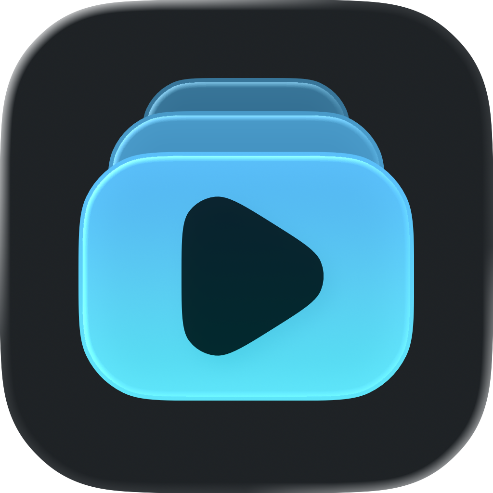
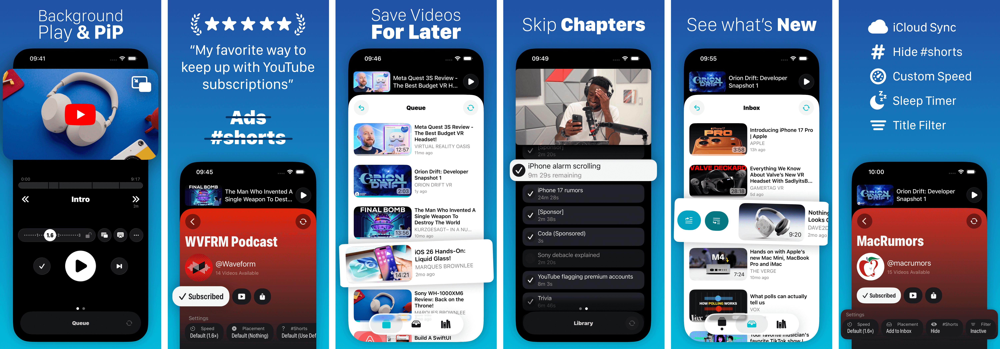

  

<h1 align="center"/>Unwatched</h1>

  RSS feed based YouTube video player for iOS

  

## Unwatched

Add Videos to watch them later or follow YouTube channels!

Available on the App Store for free: [Download](https://apps.apple.com/app/id6477287463).

## KEY FEATURES

### The Queue

No autoplay, no algorithmic bottomless feed. Just the Videos queued up in the order you want to.

### Follow Channels or Playlist

Automatically add new videos

### Triage

Choose where new videos from each channel should end up. Directly on top of the queue, or in your inbox to sort through them. Pick the best, leave the rest.

### Sick of #shorts?

Hide them all.

### Custom Playback Speed Per Channel

Set custom speeds for any channel. Want to watch trailers in 1x and podcasts in 2x? You can.

### Chapter Support

Jump to any chapter or pick and choose a few to watch while skipping the rest.

### MORE

- Picture-in-Picture (+ Background Audio)
- Drag and drop videos & channel urls
- Add Video Shortcut
- Continuous play
- Notifications
- Sleep Timer
- Custom Themes
- Directly Import YouTube Subscriptions
- iCloud Sync

## Setup

In order to build this project, you need to add a `apiKey.swift` file that contains a [YouTube Data API Key](https://developers.google.com/youtube/registering_an_application). An `apiKey.swift.example` file is already in this project.

## Attribution

- Using [SponsorBlock](https://sponsor.ajay.app/) to enhance chapters
