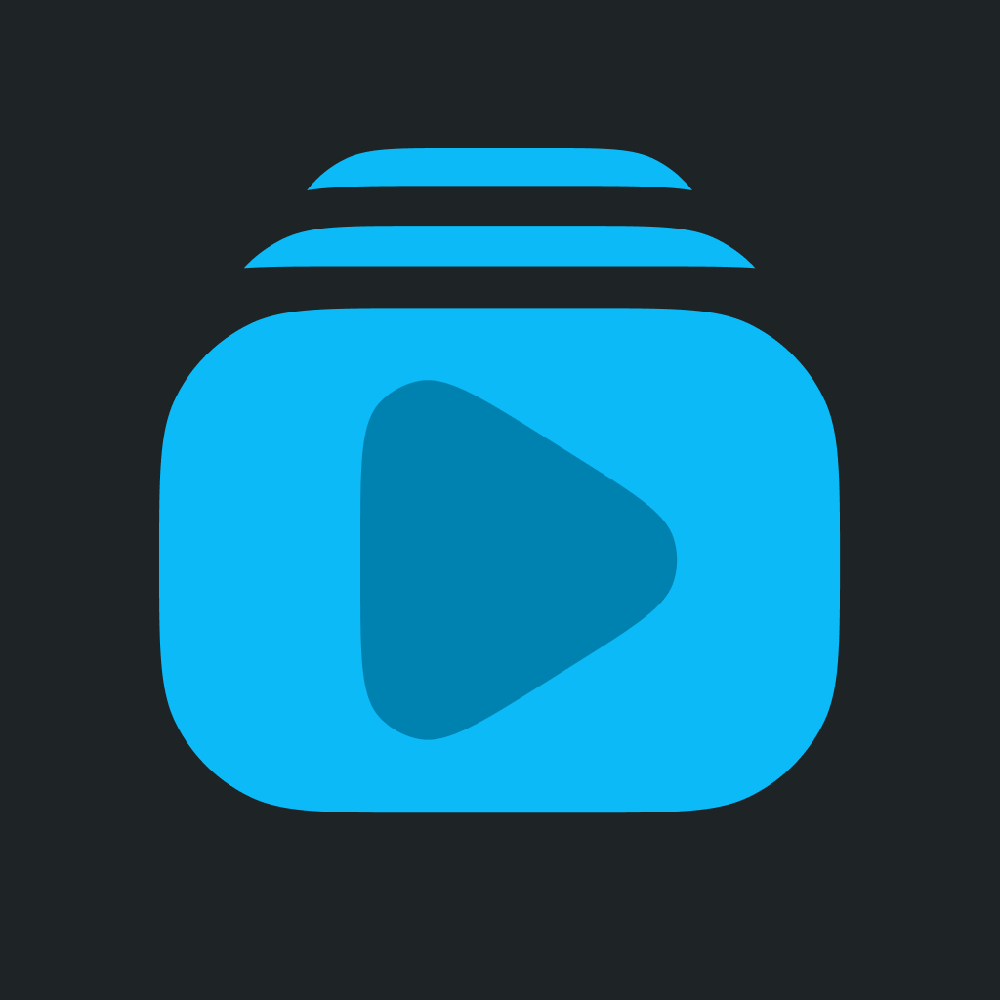

  

<h1 align="center"/>Unwatched</h1>

  RSS feed based YouTube video player for iOS

  

## Unwatched

Add Videos to watch them later or follow YouTube channels!

## KEY FEATURES

### The Queue
No autoplay, no alorithmic bottomless feed. Just the Videos queued up in the order you want to.

### Follow Channels or Playlist
Automatically add new videos

### Triage
Choose where new videos of from each channel should end up. Directly on top of the queue, or in your inbox to sort through them. Pick the best, leave the rest.

### Sick of #shorts?
Hide them all or sort through them separately.

### Custom Playback Speed Per Channel
Set custom speeds for any channel. Want to watch trailers in 1x and podcasts in 2x? You can.

### Chapter Support
Jump to any chapter or pick and choose a few to watch while skipping the rest.

### MORE
- Picture-in-Picture (+ Background Audio)
- Drag and drop videos & channel urls
- Add Video Shortcut
- Continuous play
- Notifications
- Sleep Timer
- Custom Themes
- Directly Import YouTube Subscriptions
- iCloud Sync
